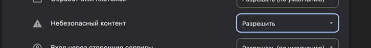

# Запуск проекта

### `yarn install`

### `yarn start`

## Когда приложение задеплоено и оно стучиться к API с https на http CSP блокирует его. Для того чтобы все нормально работало нужно ручками выключить Разрешение на небезопасный контент.

